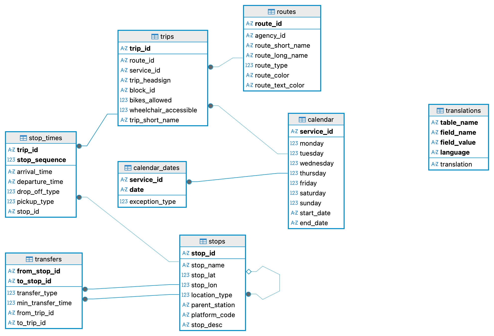

# 🚉 RailPulse: Belgian Transit SQL Analysis

[](https://www.python.org/)
[](https://www.sqlite.org/index.html)

## 📑 Contents
- [Description](#-description)
- [Repo structure](#-repo-structure)
- [Database structure](#-database-structure)
- [Key findings](#-key-findings)
- [Usage](#-usage)
- [Timeline](#️-timeline)
- [Personal situation](#-personal-situation)

## 📖 Description

**RailPulse** is a SQL-first analytics project built for a fictional urban mobility consulting firm asked to audit the operational performance of the Belgian National Railway (SNCB/NMBS). Starting from raw SNCB static GTFS feeds (`.txt` files covering routes, trips, stops, schedules, calendars and transfers), the project builds a normalized **SQLite** database from scratch and answers a set of operational questions — peak departure hours, platform bottlenecks, busiest destinations, service frequency, and accessibility coverage — using SQL.

The project's central constraint shaped its design: **no pandas or dataframe engines**. Python is only allowed to read files and execute raw SQL through `sqlite3`, so every transformation that would normally be a one-liner in pandas (type casting, empty-column pruning, schema alignment) had to be written by hand against plain lists of dicts.

## 📦 Repo structure

```
liveboard_sql/
├── assets/
│   └── database_schema.png
├── data/
│   └── raw/
│       └── sncb/
│           └── railwaypulse.zip
├── notebooks/
│   ├── sncb_build_database.ipynb
│   └── sncb_sql_queries.ipynb
├── src/
│   ├── build.py
│   ├── clean.py
│   └── fetch.py
├── main.py
├── queries.sql
├── README.md
└── requirements.txt
```

### 🧩 Project modules

- `src/fetch.py` retreives the data. `download_gtfs_feed()` downloads the data from the API if the user provides a key (optional). `extract_local_zip()` extracts the files from the .zip file and makes them ready for the next steps.
- `src/clean.py` handles all raw-data handling: `read_csv_file()` loads a GTFS `.txt` file into a list of dicts using the standard library's `csv.DictReader` (everything stays a string at this stage), `drop_empty_columns()` strips out columns that are empty across every row, and `prepare_rows()` / `cast_value()` project each row down to a table's declared columns and cast each value to its target SQL type (`int`, `float`, or `str`), turning empty strings into `NULL` where appropriate.
- `src/build.py` owns the schema. `TABLE_SCHEMAS` declares, per table, the ordered list of `(column, type)` pairs used for casting; `build_database()` drops and recreates all eight tables in dependency order with explicit `PRIMARY KEY` / `FOREIGN KEY` constraints; `insert_rows()` and `load_data_to_database()` insert the cleaned rows via `executemany`, again respecting parent-before-child ordering so foreign keys resolve correctly.
- `main.py` is the entry point: it anchors all paths to its own location, loads the eight GTFS files, drops empty columns from the ones that need it, opens the SQLite connection, and calls into `build.py` to build the schema and load the data.
- `queries.sql` contains the five analytical queries answering the project's key questions, each with its result set logged as a comment directly below it.
- `notebooks/` holds the exploratory versions of the pipeline — `sncb_build_database.ipynb` for building the database and `sncb_sql_queries.ipynb` for running the analytical queries — kept alongside the scripted version for reference.

## 🔀 Database structure



Design note: While the `translations` table was not used for this iteration of the project, it has been included in case it is to be used later to translate station names into English, Dutch, or German (by default they are displayed in French).

## 📊 Key findings

| # | Question | Result |
|---|---|---|
| 1 | Peak departure hour (all train trips) | 10:00 is busiest, just ahead of 09:00 and 11:00 |
| 2 | Busiest platforms at Brussels-Central | Platforms 3, 4, and 2, in that order |
| 3 | Busiest morning terminal destinations (before 12:00) | Antwerp-Central, Brussels-Midi, then Leuven |
| 4 | Service frequency split | ~45% High Frequency, ~35% Medium Frequency, ~20% Low Frequency/Special |
| 5 | Accessibility coverage | Every sampled route reports bike storage as available, so the metric doesn't discriminate between routes. |

Full result sets are logged as comments beneath each query in `queries.sql`.

## 📌 Usage

1. Clone the repository and create a virtual environment; install `requirements.txt`.
2. Run the pipeline:
   ```bash
   python main.py
   ```
   This builds `data/railwaypulse.db`, creates all eight tables, and loads the cleaned GTFS data into them.
   Please note that if you want to download the data from the API instead of the pre-loaded data you will need to create an account [here](https://data.belgianmobility.io/en/data.html) to obtain your own BMC API key.
3. Run `queries.sql` against `data/railwaypulse.db` (e.g. by using a GUI client such as DBeaver) to reproduce the analytical answers above.

## ⏱️ Timeline

This project was completed over 4 days.

## 📌 Personal situation

This project was done as part of the AI & Data Science Bootcamp at BeCode.

👥 Connect with me via [LinkedIn](https://www.linkedin.com/in/guillermo-gallent/).