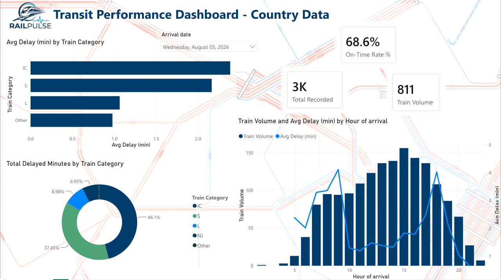
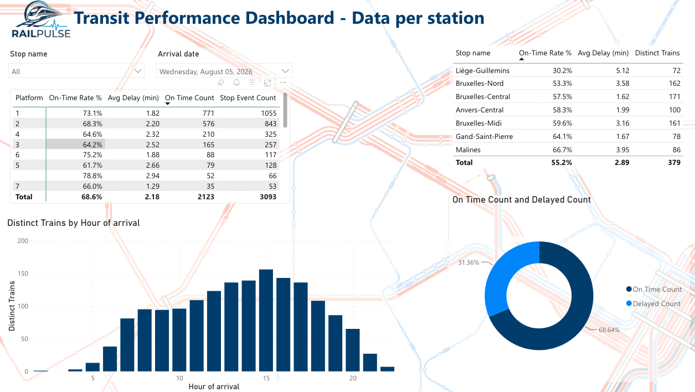

# 📊 RailPulse Analytics: Transit Performance Dashboard

## 📑 Contents
- [Description](#-description)
- [Dashboard views](#-dashboard-views)
- [Data model](#-data-model)
- [Data collection methodology](#-data-collection-methodology)
- [Key findings](#-key-findings)
- [Design decisions](#-design-decisions)
- [Known limitations & data caveats](#-known-limitations--data-caveats)
- [Suggestions for SNCB](#-suggestions-for-sncb)
- [Usage](#-usage)
- [Timeline](#️-timeline)
- [Personal situation](#-personal-situation)

## 📖 Description

**RailPulse Analytics** is the third sprint of the RailPulse project, building a two-page Power BI dashboard on top of the Azure pipeline delivered in Sprint 2. The dashboard connects directly to the live GTFS-RT star schema (`trip_stop_updates` as the central fact table, joined to `dim_stations`, `dim_trips`, `dim_routes`, and `trip_updates`) and translates raw timestamps and delay-in-seconds fields into two complementary views:

- **Country Data** — network-wide punctuality KPIs, train-category performance breakdown (average delay vs. total delayed minutes), and an hourly nationwide traffic/delay matrix.
- **Data per Station** — platform-level congestion detail for a selected station, an hourly volume chart, and a cross-station on-time ranking table for context.

Built entirely in the **Power BI web app** (app.powerbi.com).

## 🖼️ Dashboard views

> Screenshots included below as a static record of the dashboard's state at submission, since the Power BI Pro trial license (and any public link built on it) expires after 60 days.

### Country Data — Punctuality KPIs, Train Class Breakdown, Rush Hour Matrix

### Data per Station — Platform Congestion, Hourly Volume, Station Ranking

## 🔀 Data model

The dashboard consumes the same star schema built in Sprint 2:

- **Fact table:** `trip_stop_updates` (one row per stop in a trip's real-time update, holding `arrival_delay`, `departure_delay`, `arrival_time`, `stop_sequence`)
- **Dimensions:** `dim_stations` (`stop_id`, `stop_name`, `platform_code`, `parent_station`), `dim_routes` (`route_id`, `route_short_name`, `route_type`), `dim_trips` (`trip_id`, `route_id`)
- **Bridge table:** `trip_updates` (one row per polling snapshot of a trip, holding `trip_id`, `update_timestamp`, `update_pk`)
- **Relationship chain:** `dim_stations (1) → trip_stop_updates (*) → trip_updates (1) → dim_trips (1)` / `dim_routes (1)`

All delay values are stored in **seconds**. A train is considered on-time if its delay is under **120 seconds (2 minutes)**.

**Polling deduplication:** because the live feed was polled every 10 minutes over a 24-hour window (see [Data collection methodology](#-data-collection-methodology)), a single physical trip can appear across multiple `trip_updates` snapshots. A calculated column, `IsLatestUpdate`, flags only the most recent snapshot per `trip_id`; every volume and count-based measure in the dashboard (`Stop Event Count`, `Distinct Trains`, `Total Recorded`, delayed-minutes totals) filters through this flag so that repeated polls of the same trip aren't counted as separate trains or stop events.

## 📡 Data collection methodology

The Sprint 2 Azure Function is HTTP-triggered rather than timer-triggered, to avoid the cost of an always-on Consumption plan schedule. To still capture a representative 24-hour window of live data for this dashboard, the function was triggered externally using a browser extension that refreshed the function's endpoint every 10 minutes. This ran successfully for a full day and captured data across both morning and evening peak hours, which turned out to be essential. The rush-hour delay patterns described below would not have been visible without that continuous coverage.

## 🔎 Key findings

**1. Network-wide on-time rate: 70.8%** — of stop updates with recorded delay data, 70.8% arrived within the 2-minute threshold. Building this measure surfaced a DAX pitfall worth documenting: in DAX, `BLANK() < 120` evaluates to `TRUE`, so an unguarded numerator measure silently counted rows with *missing* delay data as "on-time." The fix required excluding blanks from both the numerator and denominator with an explicit `NOT(ISBLANK(...))` guard, so the rate reflects a consistent subset in both directions.

**2. Average delay and total delay burden tell different stories by train category.** By **average delay per stop**, `IC` trains rank worst (~2.3 min), followed by `Other` (~1.8 min), `S` (~1.3 min), and `L` (~1.3 min) — InterCity trains run the latest on a per-trip basis. But by **total delayed minutes network-wide**, the picture shifts. `IC` still leads (~49% of total delayed minutes), but `S` contributes nearly a third (~32%) despite its much lower per-trip average, because `S` lines are far more numerous than `IC`. A lower average delay spread across many more trips adds up to a comparable total delay burden. Reporting both metrics side by side, rather than only the average, was necessary to surface this.

**3. Two distinct regional rush-hour patterns.** Looking at the multi-platform stations with the highest recorded activity (Antwerp-Central, Brussels-Central, Brussels-Midi, Brussels-North, Ghent, Liège, and Mechelen), delay peaks split geographically:
- **Brussels stations** (Central, Midi, North) peak in the **morning**, around 9:00.
- **Other major stations** (Antwerp, Ghent, Liège, Mechelen) peak more in the **afternoon/evening**, around 18:00.

A plausible explanation is **commuter flow**: Brussels is Belgium's primary employment hub, with a large share of its workforce commuting in daily from Flanders and Wallonia. Under that reading, the morning peak at Brussels stations reflects commuters arriving for work, and the evening peak at outer stations reflects the same commuters heading home. **This is offered as a hypothesis, not a conclusion confirmed by the dataset** as GTFS data shows delay patterns, not passenger counts or trip purpose.

**4. Platform-level congestion at Brussels-Central.** Platform 6 stands out with both the highest average delay (2.86 min) and high volume (70 recorded trains). Average delay and on-time rate don't always agree at the platform level. A platform can rank poorly on one and acceptably on the other, depending on whether it experiences consistent minor delays versus occasional outliers. Both metrics are reported side by side rather than collapsed into a single "worst platform" claim.

**5. Station-level on-time rates vary widely, but sample size should be checked before over-reading the ranking.** Across the curated station list, on-time rates range from roughly 34% (Liège-Guillemins) to over 80% (Antwerp-Central), with Brussels stations clustered in the middle-to-lower range. The lowest-ranked stations also tend to have smaller recorded-trip counts than the highest-ranked ones, so this ranking is presented as a starting point for further investigation rather than a definitive station-by-station verdict.

## 🧠 Design decisions

- **Dashboard filtered to trains only.** `dim_routes.route_type = 2` (rail) is applied throughout, excluding bus routes present in the same database.
- **`arrival_time` explicitly typed as Text in Power Query**, not left to auto-detection. Power BI's default type inference converted the raw `HH:MM:SS` GTFS string into a Date/Time value, which silently reformatted it (and would have mangled past-midnight times like `25:30:00`).
- **Polling snapshots deduplicated via `IsLatestUpdate`** (see [Data model](#-data-model)) so that volume-based metrics reflect distinct trains and stop events, not raw polling frequency.
- **Low-sample categories are flagged, not hidden.** Hours, platforms, stations, or categories built from a small number of recorded trips can produce misleadingly extreme averages. Sample-size measures (`Distinct Trains`, `Stop Event Count`, `Total Recorded`) are surfaced as visible table columns alongside every average, rather than trusting the average in isolation.
- **Station names filtered to a curated list**, rather than the full station table, due to inconsistent multilingual spellings in the feed (e.g. `Bruxelles-Central` vs. `Brussel-Centraal`) that would otherwise fragment the same physical station into multiple rows.

## ⚠️ Known limitations & data caveats

- **Real-time delay coverage is partial, not network-wide.** The GTFS-RT feed does not report `arrival_delay`/`departure_delay` for every route. A significant share of stop updates have no recorded delay value, possibly reflecting which vehicles have real-time tracking enabled rather than a data quality issue in this pipeline. Every delay-based metric in this dashboard is scoped to the subset of stop updates with recorded delay data, not the full network. This is the most important caveat for interpreting any number in this dashboard.
- **Data spans a single captured day**, not a longitudinal sample. Findings on rush-hour timing and regional patterns are based on one day's real-time capture and would benefit from repeated collection to confirm they hold across weekdays, weekends, and seasons.
- **The regional commuter explanation for rush-hour timing is a hypothesis**, not a conclusion supported by passenger-level data.
- **Station-level rankings should be read alongside sample size.** Stations with fewer recorded trips are more susceptible to their on-time rate being skewed by a handful of outlier delays.

## 💡 Suggestions for SNCB

Based on the patterns surfaced in this dashboard, three areas stand out as worth investigating operationally:

1. **Improve consistency of real-time data reporting.** A large share of stop updates currently carry no delay value at all, which limits how much of the network any analysis can actually speak to. Extending real-time tracking coverage more uniformly across routes, and standardizing how missing or not-yet-available delay data is reported (rather than leaving it blank without distinction from "not tracked"), would let future analyses draw conclusions about the network as a whole rather than a partial, tracking-enabled subset.
2. **Harmonize station name/identifier encoding across the feed.** The presence of multiple spellings for the same physical station (French/Dutch variants) currently requires manual curation to analyze station-level data reliably. A single canonical station identifier per physical location, consistently applied across the feed, would make downstream station-level analysis — by SNCB or third parties — significantly easier and less error-prone.
3. **Prioritize investigation of IC delay causes and Brussels-Central Platform 6 specifically.** IC trains account for the largest share of total network delayed minutes despite running fewer distinct routes than S lines, and Platform 6 at Brussels-Central combines the highest average delay. Both are concrete, high-confidence starting points (backed by meaningful sample sizes, not noise) for a more targeted operational review, rather than a network-wide intervention.

## 📌 Usage

1. Open the `.pbix` file in Power BI Desktop.
2. The report connects to the Azure SQL Database provisioned in Sprint 2. To refresh with new data, re-run the Sprint 2 Azure Function (see that sprint's README for setup) and trigger a manual dataset refresh from the Power BI Service.
3. Use the station slicer on the Data per Station page to switch between major stations.

## ⏱️ Timeline

This sprint was completed over 4 days.

## 📌 Personal situation

This project was done as part of the AI & Data Science Bootcamp at BeCode.

👥 Connect with me via [LinkedIn](https://www.linkedin.com/in/guillermo-gallent/).