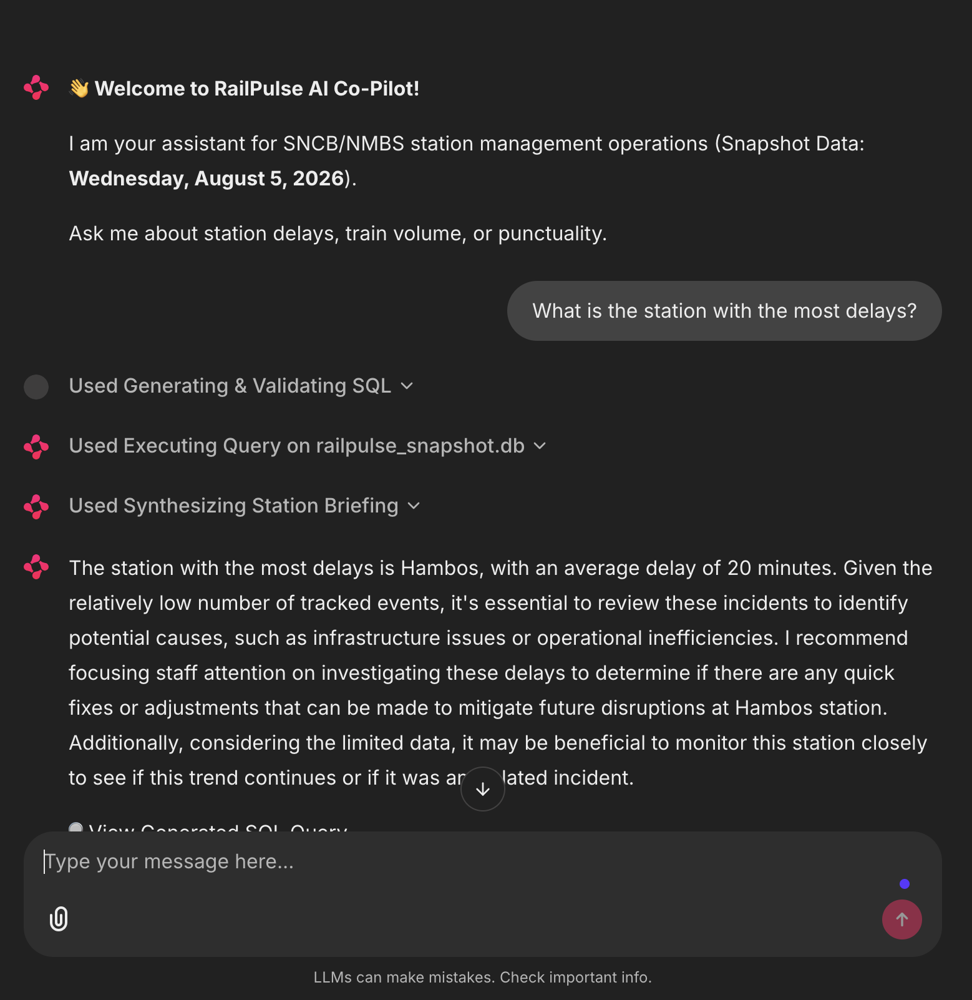
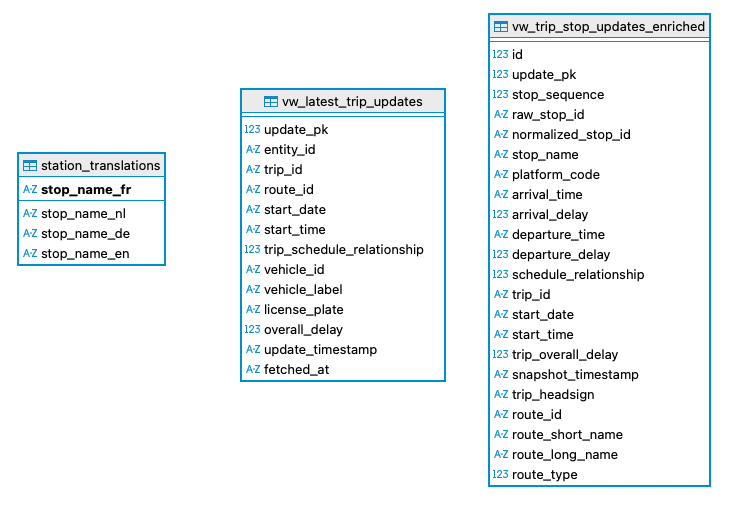
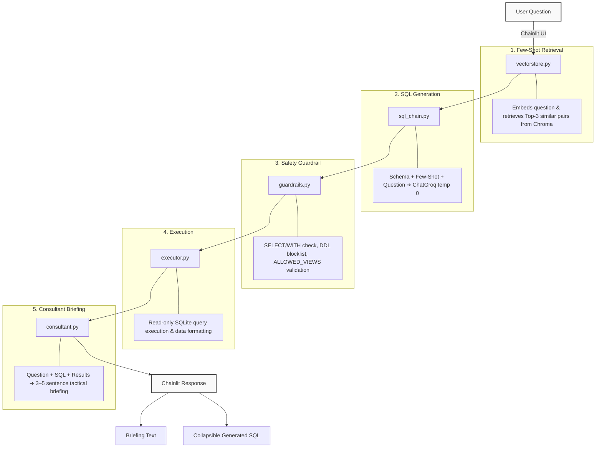

# 🤖 RailPulse AI: Text-to-SQL Co-Pilot

[](https://www.python.org/)
[](https://chainlit.io/)
[-F55036)](https://groq.com/)
[](https://www.langchain.com/)
[](https://www.trychroma.com/)
[](https://www.sqlite.org/index.html)

## 📑 Contents
- [Description](#-description)
- [Screenshot](#️-screenshot)
- [Repo structure](#-repo-structure)
- [Database structure](#-database-structure)
- [Text-to-SQL pipeline](#-text-to-sql-pipeline)
- [Design decisions](#-design-decisions)
- [Known limitations & data caveats](#-known-limitations--data-caveats)
- [Usage](#-usage)
- [Timeline](#️-timeline)
- [Personal situation](#-personal-situation)

## 📖 Description

**RailPulse AI** is the fourth and final sprint of the RailPulse project, an
open-source-only, text-to-SQL conversational assistant for SNCB/NMBS station
managers, built on top of the Azure pipeline (Sprint 2) and Power BI dashboard
(Sprint 3) delivered in earlier sprints.

A station manager types a question in plain language (*"Which platform at
Bruxelles-Central had the worst average delay?"*) and the app translates it
into a safe, read-only SQL query, executes it against the RailPulse dataset,
and hands the result to a second LLM chain that writes a short tactical
briefing for a non-technical audience. No raw numbers, no SQL, no database
jargon reach the manager directly.

Everything runs on **open-source infrastructure**: Groq's free developer tier
serves `llama-3.3-70b-versatile`, LangChain (LCEL) wires the two chains
together, ChromaDB provides local few-shot retrieval, and Chainlit provides
the chat UI — no paid third-party API is required to run or demo the project.

## 🖼️ Screenshot




## 📦 Repo structure

```
04_genai_chatbot/
├── assets/
│   ├── agent_screenshot.png
│   └── db-structure.png
├── utils/
│   ├── consultant.py
│   ├── executor.py
│   ├── export_to_sqlite.py
│   ├── guardrails.py
│   ├── inspector.py
│   ├── prompts.py
│   ├── query_examples.py
│   ├── sql_chain.py
│   ├── translations.txt
│   ├── vectorstore.py
│   └── views.sql
├── app.py
├── chainlit.md
├── railpulse_snapshot.db
├── README.md
└── requirements.txt
```

### 🧩 Project modules

- `utils/prompts.py` is the single source of truth for the LLM's world:
  `ALLOWED_VIEWS` (reused as the guardrail's table allow-list), `SCHEMA_CONTEXT`
  (full column docs plus data-quality caveats), `SQL_GENERATION_SYSTEM_PROMPT`
  (SELECT-only, no markdown fences, delays stay in seconds), and
  `CONSULTANT_SYSTEM_PROMPT` (3–5 sentence station-manager voice, delays already
  in minutes, never mentions SQL).
- `utils/query_examples.py` holds 18 curated `(question, SQL)` pairs spanning
  delays/punctuality, traffic/volume, time-of-day patterns, comparisons,
  data-quality-aware questions, and multilingual station lookups.
- `utils/vectorstore.py` embeds those pairs with
  `sentence-transformers/all-MiniLM-L6-v2` into a local Chroma collection and
  exposes `get_similar_examples(question, k=3)`, returning the top-k matches
  formatted for direct injection into the SQL-generation prompt.
- `utils/sql_chain.py` builds the LCEL text-to-SQL chain (schema + few-shot
  block + question → `ChatGroq` (temperature 0) → `StrOutputParser`) strips
  any markdown fences the model adds despite instructions, then runs the
  result through `guardrails.py` before returning it.
- `utils/guardrails.py` validates every generated query. It must start with
  `SELECT`/`WITH`, blocks write/DDL keywords (`INSERT`, `DROP`, `PRAGMA`, …),
  blocks multi-statement injection via internal semicolons, and enforces the
  `ALLOWED_VIEWS` table allow-list.
- `utils/executor.py` runs the validated query against `railpulse_snapshot.db`
  opened in **read-only** mode (`file:...?mode=ro`), then converts every delay
  column from seconds to minutes (rounded to 1 decimal) in Python before
  results leave the database layer.
- `utils/consultant.py` is the second chain: question + SQL + formatted
  results → `ChatGroq` → a 3–5 sentence tactical briefing, using
  `CONSULTANT_SYSTEM_PROMPT`.
- `app.py` is the Chainlit entrypoint. It chains generation → guardrail →
  execution → briefing as three visible `@cl.Step`s ("Generating &
  Validating SQL", "Executing Query on railpulse_snapshot.db", "Synthesizing
  Station Briefing"), then renders the briefing with the generated SQL tucked
  into a collapsible `<details>` block.
- `utils/export_to_sqlite.py`, `utils/inspector.py`, `utils/views.sql`, and
  `utils/translations.txt` are **not part of the running app** — they document
  how the local snapshot was produced (see [Database structure](#-database-structure))
  and are included strictly for pre-treatment transparency.
- `requirements.txt` pins the exact library versions this sprint was
  built and tested against (see
  [Known limitations & data caveats](#-known-limitations--data-caveats) for
  why the versions are pinned rather than left open).

Every Python file anchors its own paths with
`THIS_DIR = Path(__file__).resolve().parent` and a `REPO_ROOT` derived from
it, so `.env`, the SQLite file, `translations.txt`, and the Chroma persist
directory always resolve relative to the file itself rather than the working
directory a script happens to be launched from.

## 🔀 Database structure



The LLM is only ever shown **three** tables (never the raw Sprint 2 tables)
so that deduplication and ID-normalization logic can't be reproduced (or
gotten wrong) by the model itself:

| Table | Grain | Purpose |
|---|---|---|
| `vw_latest_trip_updates` | 1 row per `trip_id` | Trip-level status, already deduplicated to the latest polling snapshot |
| `vw_trip_stop_updates_enriched` | 1 row per (trip, stop) | Stop-level delay events, joined out to station/route/trip names |
| `station_translations` | 1 row per station | FR → NL/DE/EN station name lookup, parsed from GTFS `translations.txt` |

**Azure SQL to local SQLite pivot.** Sprints 2 and 3 ran against a live Azure SQL
Server fed by an Azure Functions GTFS-RT pipeline. For this sprint, that live
connection was retired to conserve Azure credits and because the live-polled
dataset was too sparse on most days for meaningful analysis. Instead, the two
Azure SQL reporting views above were queried **once** (`utils/export_to_sqlite.py`)
and exported into a local `railpulse_snapshot.db`. The chatbot runs **100%
locally** against that snapshot with zero runtime Azure dependency. This is a
stated prototype constraint, not a hidden shortcut. SQLite table names
intentionally match the Azure view names so `prompts.py`'s schema doc and the
guardrail allow-list didn't need to change when the data source moved.

**Single-day scope.** All data is scoped to **Wednesday, 5 August 2026**
(`start_date = '20260805'`), the only day with a fully-populated live polling
window. Every row already belongs to this date, so the LLM is instructed not
to filter on `start_date` itself, and not to answer questions implying
multi-day trends.

Both reporting views were built directly against Azure SQL (`utils/views.sql`)
to solve two data-quality issues inherited from Sprints 2 and 3:

- **Deduplication**: `trip_updates` is polled every ~10 minutes, so a single
  `trip_id` accumulates many snapshot rows. `vw_latest_trip_updates` keeps
  only the latest one via `ROW_NUMBER() OVER (PARTITION BY trip_id ORDER BY
  update_timestamp DESC, fetched_at DESC)`. Confirmed dedup ratio: **1,669
  rows** in the deduplicated view vs. the full raw `trip_updates` table.
- **`stop_id` normalization**: `trip_stop_updates.stop_id` frequently carries
  a platform suffix (e.g. `gs:nmbssncb:8864501_3`) not present in
  `dim_stations`, affecting **256,545 rows**. `vw_trip_stop_updates_enriched`
  resolves this via `CROSS APPLY` + a `LEFT JOIN` that tries a direct match
  first and a suffix-stripped match as fallback.
- Route info is pulled through `dim_trips.route_id` rather than
  `trip_updates.route_id`, which is **NULL** for every row in this dataset.

**Multilingual station names**: station names everywhere else in the data
(`stop_name`, `trip_headsign`, …) are in French. `station_translations` is
built from a static GTFS `translations.txt` export (Sprint 1) and provides
Dutch/German/English lookups: `stop_name_nl` contains clean, full Dutch names
matched reliably with exact equality (e.g. `Brussel-Zuid`), while
`stop_name_de`/`stop_name_en` are often abbreviated combined forms (e.g.
`Brux.-Midi/Brus.-Zuid`) unlikely to be typed verbatim, so the prompt favors
`LIKE` wildcard matching for those two.

## ⚙️ Text-to-SQL pipeline



## 🧠 Design decisions

- **Azure SQL retired in favor of a local SQLite snapshot** (see
  [Database structure](#-database-structure)) — a deliberate prototype
  decision to avoid ongoing Azure credit consumption and a runtime network
  dependency, not a shortcut.
- **The LLM only ever sees three curated views**, never the raw Sprint 2
  tables, so dedup and stop-ID normalization logic live once in SQL and can't
  be silently reproduced or gotten wrong by the model.
- **`ALLOWED_VIEWS` in `prompts.py` is the single source of truth**, driving
  both the schema context shown to the LLM and the guardrail's table
  allow-list, so the two can never drift apart.
- **NULL delay is treated as "not tracked," never as "on time,"** enforced
  consistently at the prompt, SQL, and consultant-briefing layers.
- **Pinned dependency versions, built and tested on an Intel Mac.** Development
  happened on an Intel-based (x86_64) Mac, which ruled out the newest releases
  of several libraries in this stack — most notably recent `torch` builds,
  which have progressively dropped Intel macOS wheels in favor of Apple
  Silicon and Linux/Windows targets. Since `sentence-transformers` (used for
  the Chroma few-shot embeddings) depends on `torch`, this constrains the
  whole embedding/vectorstore layer to versions still compatible with x86_64
  macOS. `requirements.txt` pins the exact versions that were confirmed
  to install and run cleanly under this constraint, rather than leaving
  ranges open.

## ⚠️ Known limitations & data caveats

- **Single-day, single-source snapshot.** All data reflects one Wednesday's
  polling window and therefore the chatbot cannot answer questions implying multi-day or seasonal trends, and the LLM is explicitly instructed not to try.
- **NULL delay ≠ on-time.** A meaningful share of stop updates carry no
  recorded delay value at all (inherited from the Sprint 2/3 feed's partial
  real-time coverage). Every layer of this app treats that as "not tracked"
  rather than silently folding it into on-time counts.
- **Intel Mac / `torch` version constraints.** This sprint was built and
  tested on an Intel Mac (macOS, x86_64) running **Python 3.12.13**. Several
  libraries in the AI stack (`torch` in particular, and by extension
  `sentence-transformers`) have dropped or reduced Intel macOS wheel support
  in their newest releases, so the newest available versions could not
  reliably be used here. To reproduce this environment exactly:
  - Use **Python 3.12**.
  - Install from **`requirements.txt`** as-is, without relaxing the
    pinned versions. On other platforms (Apple Silicon, Linux, Windows)
    newer versions of `torch`/`sentence-transformers` will likely work too,
    but were not the ones this project was validated against.
  - If you're on Apple Silicon or Linux and want the latest library versions,
    that should work, but re-verify the Chroma embedding step still runs
    cleanly before trusting the few-shot retrieval quality documented here.
- Deprecation warnings surface for `langchain_community.vectorstores.Chroma`
  and `HuggingFaceEmbeddings` (both due for a LangChain-side migration).

## 📌 Usage

1. Clone the repository and navigate to `04_genai_chatbot/`.
2. Create a virtual environment using **Python 3.12** (this sprint was built
   and tested on 3.12.13) and install the pinned dependencies:
   ```bash
   pip install -r requirements.txt
   ```
3. Set the required environment variables in a `.env` file at the repo sprint root
   (`GROQ_API_KEY`, and `GROQ_MODEL` if overriding the default
   `llama-3.3-70b-versatile`).
4. Launch the app:
   ```bash
   chainlit run app.py
   ```
5. Ask a question in plain language (French, Dutch, German, or English station
   names are all supported) and follow the three visible steps (SQL
   generation & validation, execution, and briefing synthesis) through to the
   final tactical recommendations.

## ⏱️ Timeline

This sprint was completed over 4 days.

## 📌 Personal situation

This project was done as part of the AI & Data Science Bootcamp at BeCode.

👥 Connect with me via [LinkedIn](https://www.linkedin.com/in/guillermo-gallent/).