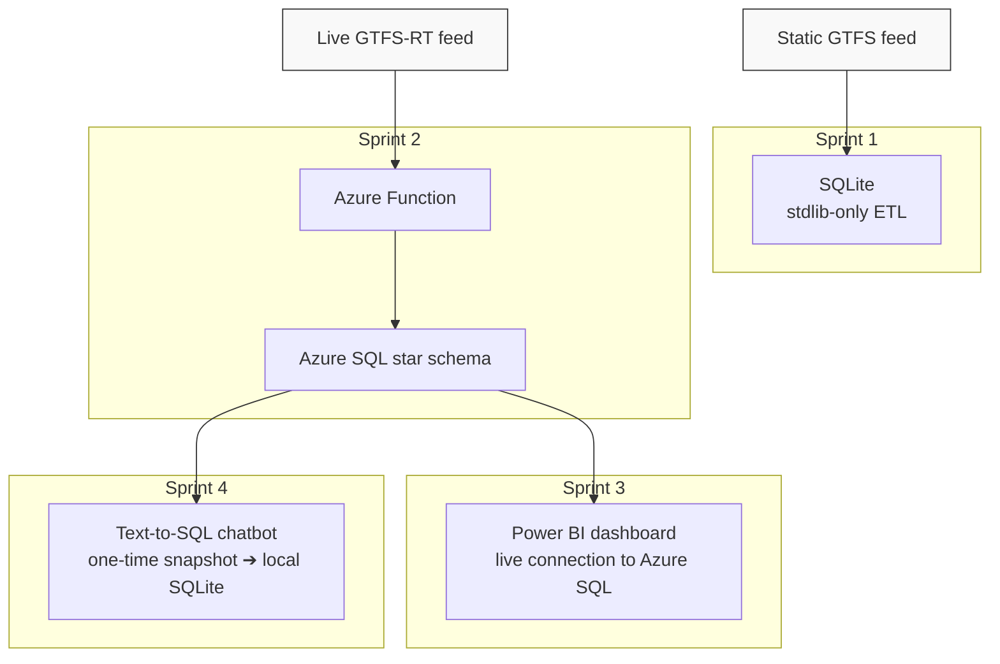

# 🚉 RailPulse: Belgian Railway Data & AI Portfolio Project

[](https://www.python.org/)
[](https://azure.microsoft.com/)
[](https://app.powerbi.com/)
[](https://www.langchain.com/)
[](https://creativecommons.org/licenses/by/4.0/)

## 📑 Contents
- [Description](#-description)
- [Repo structure](#-repo-structure)
- [The four sprints](#-the-four-sprints)
- [End-to-end pipeline](#-end-to-end-pipeline)
- [Data source & attribution](#-data-source--attribution)
- [Timeline](#️-timeline)
- [Personal situation](#-personal-situation)

## 📖 Description

**RailPulse** is a multi-sprint, end-to-end portfolio project analyzing operational performance on the Belgian National Railway (SNCB/NMBS). It starts from a raw static GTFS feed, works up through a live cloud ingestion pipeline and a BI dashboard, and finishes as a natural-language SQL co-pilot for station managers. Each sprint is self-contained, with its own README, but they share the same underlying dataset and build directly on one another. The schema decisions made in Sprint 1 carry into Sprint 2's Azure pipeline, Sprint 3's dashboard sits on top of that same pipeline, and Sprint 4's chatbot is a curated, LLM-safe view onto the same tables again.

## 📦 Repo structure

```
railpulse/
├── 01_liveboard_sql/        # Sprint 1 — static GTFS → SQLite
├── 02_azure_deployment/     # Sprint 2 — live GTFS-RT → Azure SQL
├── 03_powerbi_dashboard/    # Sprint 3 — Power BI dashboard on Azure SQL
├── 04_genai_chatbot/        # Sprint 4 — text-to-SQL AI chatbot
└── README.md                # you are here
```


## 🧩 The four sprints

| # | Sprint | What it does | Stack |
|---|---|---|---|
| 1 | **[RailPulse](./01_liveboard_sql/)** | Parses the static SNCB/GTFS feed with stdlib-only Python (no pandas) and builds a normalized SQLite database, then answers five operational questions in SQL. | `sqlite3` |
| 2 | **[RailPulse Cloud](./02_azure_deployment/)** | Moves ingestion to an Azure Function that polls the live GTFS-RT feed and writes normalized rows into an Azure SQL star schema, seeded with static GTFS dimensions. | Azure Functions, Azure SQL, `pyodbc` |
| 3 | **[RailPulse Analytics](./03_powerbi_dashboard/)** | A two-page Power BI dashboard on top of the Sprint 2 schema, covering network-wide punctuality, train-category delay burden, and platform-level congestion. | Power BI (web), DAX |
| 4 | **[RailPulse AI](./04_genai_chatbot/)** | A Chainlit chat app that turns plain-language questions into read-only SQL against a curated database snapshot, then rewrites the results to answer the questions and suggest follow-up actions for the train system managers. | Groq (Llama 3.3), LangChain LCEL, ChromaDB, Chainlit |

## ⚙️ End-to-end pipeline



Each sprint's README documents its own design decisions, known limitations, and usage instructions in full.

## 📜 Data source & attribution

All GTFS static and GTFS-RT data used across the four sprints originates from **NMBS-SNCB**, made available through the [Belgian Mobility Company Open Data Platform](https://data.belgianmobility.io/en/data.html). BMC operates the platform as the technical intermediary; NMBS-SNCB remains the sole licensor of the underlying data. The data is published under **[CC BY 4.0](https://creativecommons.org/licenses/by/4.0/)**.

> Source: NMBS-SNCB – Open Data – retrieved 22 July 2026 (static GTFS) and 5 August 2026 (GTFS-RT).


## ⏱️ Timeline

This pipeline was completed over four weeks.

## 📌 Personal situation

This project was done as part of the AI & Data Science Bootcamp at BeCode.

👥 Connect with me via [LinkedIn](https://www.linkedin.com/in/guillermo-gallent/).