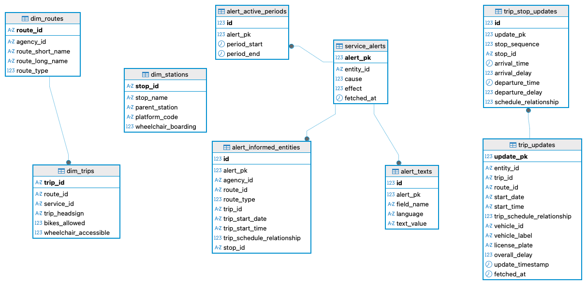

# ☁️ RailPulse Cloud: Azure Challenge

[](https://www.python.org/)
[](https://azure.microsoft.com/en-us/products/functions)
[](https://azure.microsoft.com/en-us/products/azure-sql/database)

## 📑 Contents
- [Description](#-description)
- [Repo structure](#-repo-structure)
- [Database structure](#-database-structure)
- [Design decisions](#-design-decisions)
- [Usage](#-usage)
- [Timeline](#️-timeline)
- [Personal situation](#-personal-situation)

## 📖 Description

**RailPulse Cloud** is the second sprint of the RailPulse project, moving from a static GTFS feed loaded into local SQLite to a live GTFS-**Realtime** pipeline running on Azure. An Azure Function (Python, Consumption plan) fetches two live feeds from the SNCB/NMBS BMC open data API — `/rt/trip-update` and `/rt/alert` — parses the JSON responses, and writes normalized rows into an Azure SQL Database (serverless tier).

The core challenge here wasn't the cloud plumbing so much as the data itself: the GTFS-RT spec suggests a shape that the live feed doesn't always follow. Several fields that the docs describe as one type turn out to arrive as another in practice, which shaped both the schema and the parsing logic — see [Design decisions](#-design-decisions) below.

## 📦 Repo structure

```
azure_deployment/
├── assets/
│   └── db-structure.png
├── function_app.py
├── host.json
├── local.settings.json
├── queries.sql
└── requirements.txt
```

### 🧩 Project modules

- `function_app.py` is the Azure Function itself (Functions Python v2 model, HTTP trigger). On each invocation it fetches both feeds from the BMC API, parses the JSON, and inserts rows into Azure SQL — parent rows first, then children, using `OUTPUT INSERTED.<pk>` to capture the generated surrogate key for each parent and use it as the foreign key on its children.
- `host.json` / `local.settings.json` hold the Functions runtime configuration and local-only environment variables respectively (see [Usage](#-usage) for the required variables — `local.settings.json` is gitignored and never committed).
- `queries.sql` contains ad-hoc validation queries used to sanity-check the pipeline against Azure SQL during development (row counts, parent-child linkage checks, etc.), rather than the analytical queries from the static-feed sprint.
- `requirements.txt` lists the only external dependency, `pyodbc`, needed to connect to Azure SQL from Python.

## 🔀 Database structure



Six tables cover the two feeds:
- **Trip updates**: `trip_updates` (parent) → `trip_stop_updates` (child, one row per stop in a trip's `stopTimeUpdate` array)
- **Alerts**: `service_alerts` (parent) → `alert_active_periods`, `alert_texts`, `alert_informed_entities` (children)

Parent tables use surrogate `IDENTITY` primary keys (`update_pk`, `alert_pk`), since the child tables have optional/nullable fields that rule out a composite natural key.

## 🧠 Design decisions

A few choices worth calling out explicitly, since they weren't obvious from the GTFS-RT spec alone:

- **JSON, not protobuf.** The BMC/nmbssncb API returns GTFS-Realtime data as JSON at `.../rt/{trip-update|alert}/`, rather than the raw protobuf format the spec is usually associated with.
- **`timestamp` arrives in two shapes.** `tripUpdate.timestamp` sometimes comes through as a plain integer and sometimes as a protobuf "Long" object (`{low, high, unsigned}`). A small parsing helper normalizes both into a proper SQL `datetime`.
- **`scheduleRelationship` is a raw integer at both levels.** The spec implies the stop-level field might be a string enum in practice it's an integer, same as the trip-level field, so both are stored as raw `INT` and left to be interpreted at query time against the standard GTFS-RT enum values.
- **`cause`/`effect` on alerts are stored as raw integer codes, not pre-mapped to text.** A sample alert's `cause=1` didn't line up with the standard GTFS-RT label given the actual alert content, so rather than bake in a possibly-wrong mapping, these are left as `INT` for query-time interpretation.
- **Alerts get child tables, not flat columns**, because a single alert can have multi-language text (`fr`/`nl`/`de`/`en` via `translation` arrays on `headerText`/`descriptionText`/`url`) and multiple `activePeriod` date ranges.
- **Snapshot history, not upsert.** Each function invocation inserts new rows into `trip_updates`/`service_alerts` rather than updating existing ones in place. This is intentional: it means the database accumulates a time series of how a trip or alert evolves across fetches, rather than only ever showing current state. Querying "current state" just means taking the latest `update_pk`/`alert_pk` per `trip_id`.
- **`activePeriod` was empty for every alert observed during testing**, and `informedEntity` always contained exactly one entity. Both were checked against the raw API response to confirm this reflects the live feed's actual content rather than a parsing gap — the child tables are still there to correctly hold multiple rows if a future alert does have more than one.

## 📌 Usage

1. Clone the repository and navigate to `azure_deployment/`; create a virtual environment (Python 3.12, required by the Functions Consumption plan) and install `requirements.txt`.
2. Set the following environment variables, either in `local.settings.json` for local runs or as Application Settings on the deployed Function App (the two are separate — portal settings don't apply locally, and vice versa):
   - `SQL_SERVER`, `SQL_DB`, `SQL_USER`, `SQL_PW` — Azure SQL Database connection details
   - `API_KEY` — your BMC API key ([sign up here](https://data.belgianmobility.io/en/data.html) if you don't have one)
3. Run locally with the Azure Functions Core Tools:
   ```bash
   func start
   ```
4. Trigger the function (it's an HTTP trigger):
   ```bash
   curl http://localhost:7071/api/<function-name>
   ```
   A successful run returns a small JSON summary, e.g. `{"status": "ok", "trip_updates_processed": ..., "alerts_processed": ...}`.
5. To deploy: use the Azure Functions extension in VS Code (`Azure Functions: Deploy to Function App...`) against an already-provisioned Function App (Consumption plan, Python runtime) and Azure SQL Database (serverless tier), with the same Application Settings as step 2 configured in the portal.

## ⏱️ Timeline

This sprint was completed over [X days], with a deadline of 31/07/26.

## 📌 Personal situation

This project was done as part of the AI & Data Science Bootcamp at BeCode.

👥 Connect with me via [LinkedIn](https://www.linkedin.com/in/guillermo-gallent/).
